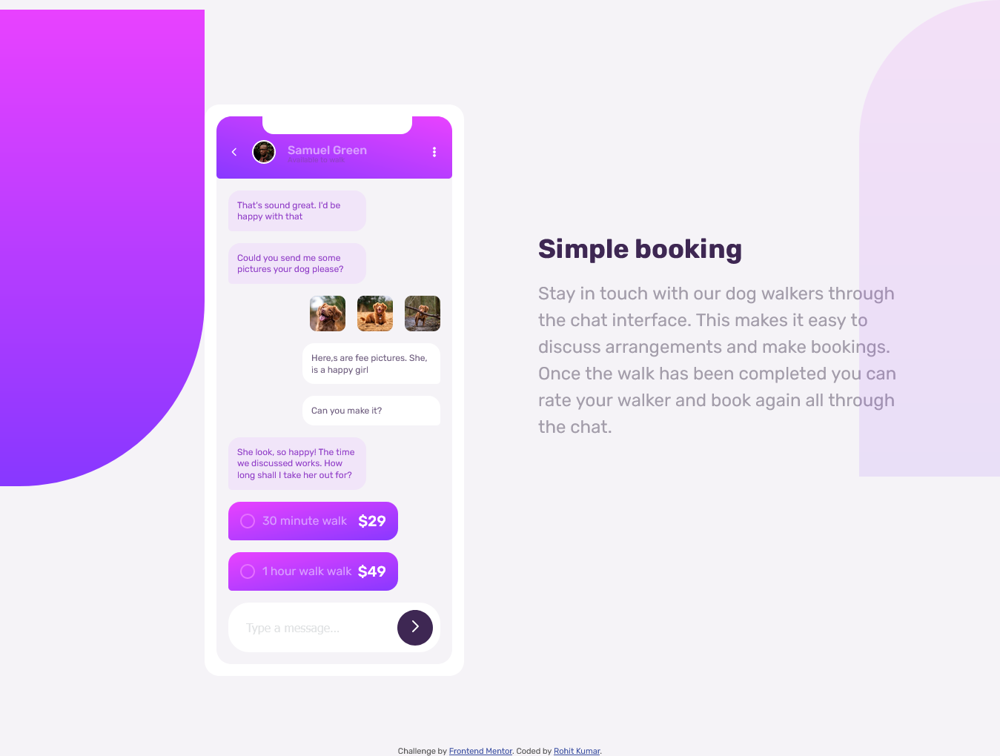

# Frontend Mentor - Chat app CSS illustration solution

This is a solution to the [Chat app CSS illustration challenge on Frontend Mentor](https://www.frontendmentor.io/challenges/chat-app-css-illustration-O5auMkFqY). Frontend Mentor challenges help you improve your coding skills by building realistic projects.

## Table of contents

- [Overview](#overview)
  - [The challenge](#the-challenge)
  - [Screenshot](#screenshot)
  - [Links](#links)
- [My process](#my-process)
  - [Built with](#built-with)
  - [What I learned](#what-i-learned)
  - [Continued development](#continued-development)
- [Author](#author)

## Overview

### The challenge

Users should be able to:

- View the optimal layout for the component depending on their device's screen size
- **Bonus**: See the chat interface animate on the initial load

### Screenshot



### Links

- Solution URL: [Github repo](https://rohitkumar38344.github.io/Frontend-Mentor---Chat-app-CSS-illustration-solution)
- Live Site URL: [live site url](https://rohitkumar38344.github.io/Frontend-Mentor---Chat-app-CSS-illustration-solution/)

## My process

### Built with

- Semantic HTML5 markup
- CSS
- Flexbox
- CSS Grid

### What I learned

Styling of radio buttons

see below:

```html
<div class="received-money">
  <label for="minute" class="radio">
    <input type="radio" name="task" id="minute" class="radio__input" />
    <div class="radio__input--custom"></div>
    30 minute walk
  </label>
  <strong class="amount">$29</strong>
</div>
```

```css
.radio {
  display: inline-flex;
  align-items: center;
  gap: 10px;
  position: relative;
  font-size: 1.6rem;
}

.radio__input {
  position: absolute;
  opacity: 0;
}

.radio__input--custom {
  width: 1.25em;
  height: 1.25em;
  border: 2px solid hsl(289, 100%, 72%);
  padding: 2px;
  border-radius: 50%;
}

.radio__input--custom::after {
  content: "";
  display: block;
  background: hsl(276, 55%, 52%);
  width: 100%;
  height: 100%;
  border-radius: 50%;
  transform: scale(0);
  transition: transform 0.15s;
}

.radio__input:checked + .radio__input--custom::after {
  transform: scale(1);
}
```

### Continued development

On Responsive Design

## Author

- Website - [RohitKumar](https://github.com/rohitKumar38344)
- Frontend Mentor - [@rohitKumar38344](https://www.frontendmentor.io/profile/rohitKumar38344)
- Twitter - [@\_iamrohitKumar](https://twitter.com/_iamrohitKumar)
